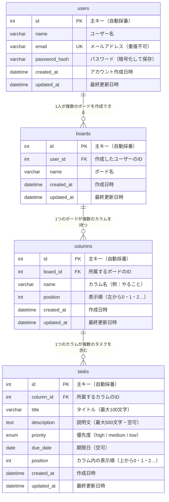

# DB設計書

**プロジェクト名：** タスク管理ボード  
**作成日：** 2026年4月25日  
**バージョン：** 1.0  
**作成者：** ○○（開発担当）

> 本ドキュメントは [要件定義書](../要件定義書.md) からデータ設計に関する内容を分離したものです。

---

## 目次

1. [現バージョンのデータ構造（localStorage）](#1-現バージョンのデータ構造localstorage)
2. [各項目の説明](#2-各項目の説明)
3. [ステータスと表示カラムの対応](#3-ステータスと表示カラムの対応)
4. [データの保存先](#4-データの保存先)
5. [ER図（将来のDB設計）](#5-er図将来のdb設計)
6. [テーブル定義（詳細）](#6-テーブル定義詳細)
7. [インデックス定義](#7-インデックス定義)
8. [制約定義](#8-制約定義)

---

## 1. 現バージョンのデータ構造（localStorage）

ブラウザの localStorage に以下の形式でデータを保存する。

```json
[
  {
    "id":        "一意のID（自動生成・例：task_1714000000000）",
    "title":     "タスクのタイトル（最大100文字）",
    "desc":      "説明文（空でも可・最大500文字）",
    "priority":  "high / medium / low のいずれか",
    "dueDate":   "2026-04-30（任意・空の場合は空文字）",
    "status":    "todo / doing / done のいずれか",
    "createdAt": "2026-04-23T10:00:00.000Z（作成日時・自動記録）"
  }
]
```

---

## 2. 各項目の説明

| 項目名 | 日本語の意味 | 必須 | 取りうる値 |
|---|---|---|---|
| id | タスクを識別するための番号 | ○ | 自動生成（重複しない） |
| title | タスクのタイトル | ○ | 文字列（最大100文字） |
| desc | タスクの説明文 | — | 文字列（最大500文字）または空 |
| priority | 優先度 | ○ | `high`（高）/ `medium`（中）/ `low`（低） |
| dueDate | 期限日 | — | `YYYY-MM-DD`形式または空 |
| status | タスクの状態（カラム） | ○ | `todo` / `doing` / `done` |
| createdAt | タスクを作成した日時 | ○ | 日時（自動記録） |

---

## 3. ステータスと表示カラムの対応

| status値 | 表示カラム |
|---|---|
| `todo` | やること |
| `doing` | 進行中 |
| `done` | 完了 |

---

## 4. データの保存先

| 項目 | 内容 |
|---|---|
| 保存場所 | ブラウザの localStorage（`taskboard_tasks`というキー名で保存） |
| 保存タイミング | タスクの追加・編集・削除・移動のたびに自動保存 |
| 読み込みタイミング | ページを開いたとき（ブラウザ起動時） |

---

## 5. ER図（将来のDB設計）

> ※ 「ER図」とは「データベースのテーブル（表）がどのような構造で、お互いにどう関連しているか」を図にしたものです。  
> 「E」は Entity（エンティティ：データのまとまり＝テーブル）、「R」は Relation（リレーション：テーブル間のつながり）の略です。  
>
> 現バージョンはブラウザ内のlocalStorageを使用していますが、将来的にサーバー・データベースを導入することを想定し、  
> その際に必要になるテーブル設計をここに定義します。

### 将来バージョンで追加されるテーブル

| テーブル名 | 日本語の意味 | 役割 |
|---|---|---|
| users | ユーザー | ログインする人の情報（名前・メール・パスワード） |
| boards | ボード | ユーザーが持つタスクボード（複数作れる） |
| columns | カラム | ボード内の列（やること・進行中・完了） |
| tasks | タスク | カラムに入るタスクカードの情報 |

### ER図



### ER図の読み方（記号の意味）

| 記号 | 意味 | 例 |
|---|---|---|
| `\|\|` | 必ず1つ | ユーザーは必ず1人 |
| `o{` | 0個以上（複数でも0でも可） | ボードは0個以上持てる |
| `\|\|--o{` | 「1対多」の関係 | 1人のユーザーが複数のボードを持てる |

---

## 6. テーブル定義（詳細）

> ※ 「テーブル定義」とは「各テーブルの列（カラム）に、どんな種類のデータが入るか」を詳しく定めたものです。

### usersテーブル（ユーザー情報）

| 列名 | データ型 | 必須 | 制約 | 説明 |
|---|---|---|---|---|
| id | INT | ○ | 主キー・自動採番 | ユーザーを識別する番号 |
| name | VARCHAR(100) | ○ | — | ユーザー名（最大100文字） |
| email | VARCHAR(255) | ○ | 重複不可（UNIQUE） | ログインに使うメールアドレス |
| password_hash | VARCHAR(255) | ○ | — | パスワードを暗号化した文字列（平文では保存しない） |
| created_at | DATETIME | ○ | 自動入力 | アカウント作成日時 |
| updated_at | DATETIME | ○ | 自動更新 | 最終更新日時 |

### boardsテーブル（ボード情報）

| 列名 | データ型 | 必須 | 制約 | 説明 |
|---|---|---|---|---|
| id | INT | ○ | 主キー・自動採番 | ボードを識別する番号 |
| user_id | INT | ○ | 外部キー（users.id） | このボードを作ったユーザーのID |
| name | VARCHAR(100) | ○ | — | ボード名（最大100文字） |
| created_at | DATETIME | ○ | 自動入力 | 作成日時 |
| updated_at | DATETIME | ○ | 自動更新 | 最終更新日時 |

### columnsテーブル（カラム情報）

| 列名 | データ型 | 必須 | 制約 | 説明 |
|---|---|---|---|---|
| id | INT | ○ | 主キー・自動採番 | カラムを識別する番号 |
| board_id | INT | ○ | 外部キー（boards.id） | このカラムが属するボードのID |
| name | VARCHAR(100) | ○ | — | カラム名（例：やること） |
| position | INT | ○ | 0以上の整数 | 左から何番目に表示するか（0始まり） |
| created_at | DATETIME | ○ | 自動入力 | 作成日時 |
| updated_at | DATETIME | ○ | 自動更新 | 最終更新日時 |

### tasksテーブル（タスク情報）

| 列名 | データ型 | 必須 | 制約 | 説明 |
|---|---|---|---|---|
| id | INT | ○ | 主キー・自動採番 | タスクを識別する番号 |
| column_id | INT | ○ | 外部キー（columns.id） | このタスクが属するカラムのID |
| title | VARCHAR(100) | ○ | — | タスクのタイトル（最大100文字） |
| description | TEXT | — | NULL可 | タスクの説明文（最大500文字） |
| priority | ENUM | ○ | high / medium / low のいずれか | 優先度 |
| due_date | DATE | — | NULL可 | 期限日（未設定の場合は空） |
| position | INT | ○ | 0以上の整数 | カラム内の表示順（上から0始まり） |
| created_at | DATETIME | ○ | 自動入力 | タスク作成日時 |
| updated_at | DATETIME | ○ | 自動更新 | 最終更新日時 |

---

## 7. インデックス定義

> ※ 「インデックス」とは「データを素早く検索できるようにするための索引」です。  
> よく検索・並び替えに使うカラムに設定すると、処理が高速化されます。

### tasksテーブルのインデックス

| インデックス名 | カラム | 用途 |
|---|---|---|
| PRIMARY | id | 主キー |
| idx_tasks_status | status | ステータスによるタスク取得の高速化 |
| idx_tasks_status_position | status, position | カラム内の表示順でのソート高速化 |

---

## 8. 制約定義

> ※ 「制約」とは「カラムに入れてよい値のルール」です。  
> データベースが自動でチェックし、違反するデータは保存できないようにします。

### tasksテーブルの制約

- `priority` は `'high'` / `'medium'` / `'low'` のいずれかの値をとる
- `status` は `'todo'` / `'doing'` / `'done'` のいずれかの値をとる
- `title` は空文字（NULL）を許可しない

---

### テーブル間のつながり（外部キー）の説明

> ※ 「外部キー」とは「別のテーブルのIDを参照する列」のことです。  
> これにより、テーブル間のデータの整合性（矛盾がない状態）を保ちます。

```
users（ユーザー）
  └── boards（ボード）      ← user_id で users.id を参照
        └── columns（カラム）  ← board_id で boards.id を参照
              └── tasks（タスク）  ← column_id で columns.id を参照
```

> **削除時の連鎖（CASCADE）：**  
> ユーザーを削除 → そのユーザーのボードも削除 → カラムも削除 → タスクも削除  
> データの孤立（親がいないデータ）が残らないよう設計する。
