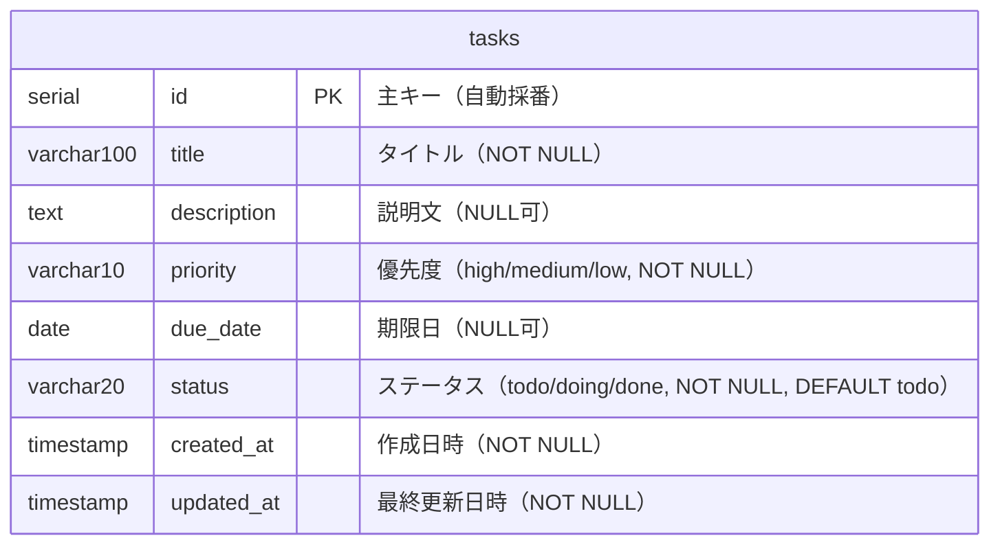

# DB設計書

**プロジェクト名：** タスク管理ボード  
**作成日：** 2026年4月25日  
**最終更新日：** 2026年5月2日  
**バージョン：** 2.0  
**作成者：** ○○（開発担当）

> 本ドキュメントは [要件定義書](../要件定義書.md) からデータ設計に関する内容を分離したものです。

---

## 目次

1. [現バージョンのデータ構造（PostgreSQL）](#1-現バージョンのデータ構造postgresql)
2. [各項目の説明](#2-各項目の説明)
3. [ステータスと表示カラムの対応](#3-ステータスと表示カラムの対応)
4. [データの保存先](#4-データの保存先)
5. [ER図（現行DB設計）](#5-er図現行db設計)
6. [テーブル定義（詳細）](#6-テーブル定義詳細)
7. [インデックス定義](#7-インデックス定義)
8. [制約定義](#8-制約定義)

---

## 1. 現バージョンのデータ構造（PostgreSQL）

PostgreSQL の `tasks` テーブルに以下のカラム構成でデータを保存する。  
テーブル定義は Flyway マイグレーション（`V1__create_initial_tables.sql`）で管理されている。

```sql
CREATE TABLE tasks (
    id          SERIAL PRIMARY KEY,
    title       VARCHAR(100) NOT NULL,
    description TEXT,
    priority    VARCHAR(10) NOT NULL CHECK (priority IN ('high', 'medium', 'low')),
    due_date    DATE,
    status      VARCHAR(20) NOT NULL DEFAULT 'todo' CHECK (status IN ('todo', 'doing', 'done')),
    created_at  TIMESTAMP NOT NULL DEFAULT CURRENT_TIMESTAMP,
    updated_at  TIMESTAMP NOT NULL DEFAULT CURRENT_TIMESTAMP
);
```

---

## 2. 各項目の説明

| カラム名（DB） | フィールド名（API） | 日本語の意味 | 必須 | 取りうる値 |
|---|---|---|---|---|
| id | id | タスクを識別するための番号 | ○ | 自動採番（1以上の整数） |
| title | title | タスクのタイトル | ○ | 文字列（最大100文字） |
| description | description | タスクの説明文 | — | 文字列（最大500文字）または NULL |
| priority | priority | 優先度 | ○ | `high`（高）/ `medium`（中）/ `low`（低） |
| due_date | dueDate | 期限日 | — | `YYYY-MM-DD`形式または NULL |
| status | status | タスクの状態（カラム） | ○ | `todo` / `doing` / `done` |
| created_at | createdAt | タスクを作成した日時 | ○ | 日時（自動記録） |
| updated_at | updatedAt | 最終更新日時 | ○ | 日時（更新のたびに自動記録） |

---

## 3. ステータスと表示カラムの対応

| status値 | 表示カラム |
|---|---|
| `todo` | やること |
| `doing` | 進行中 |
| `done` | 完了 |

---

## 4. データの保存先

| 項目 | 内容 |
|---|---|
| 保存場所 | PostgreSQL 16（Docker コンテナ）/ データベース名: `taskboard` / テーブル名: `tasks` |
| 保存タイミング | タスクの追加・更新・削除のたびに REST API 経由でDBに書き込まれる |
| 読み込みタイミング | ページを開いたとき（`GET /api/tasks` を呼び出し） |
| マイグレーション管理 | Flyway（`db/migration/` 配下のSQLファイルで管理） |

---

## 5. ER図（現行DB設計）

現バージョン（v2.0）は単一の `tasks` テーブルで構成されている。  
将来のバージョンでユーザー管理・複数ボード対応を追加する場合は、別途ER図を作成する。



---

## 6. テーブル定義（詳細）

### tasksテーブル（タスク情報）

| カラム名 | データ型 | 必須 | 制約 | 説明 |
|---|---|---|---|---|
| id | SERIAL | ○ | 主キー・自動採番 | タスクを識別する番号（1から自動増加） |
| title | VARCHAR(100) | ○ | NOT NULL | タスクのタイトル（最大100文字） |
| description | TEXT | — | NULL可 | タスクの説明文（長さ制限なし・アプリ側で500文字まで制限） |
| priority | VARCHAR(10) | ○ | NOT NULL、CHECK制約 | 優先度（high / medium / low のいずれか） |
| due_date | DATE | — | NULL可 | 期限日（未設定の場合はNULL） |
| status | VARCHAR(20) | ○ | NOT NULL、DEFAULT 'todo'、CHECK制約 | タスクの状態（todo / doing / done のいずれか） |
| created_at | TIMESTAMP | ○ | NOT NULL、DEFAULT CURRENT_TIMESTAMP | タスク作成日時（自動設定） |
| updated_at | TIMESTAMP | ○ | NOT NULL、DEFAULT CURRENT_TIMESTAMP | 最終更新日時（更新時にアプリ側で設定） |

---

## 7. インデックス定義

### tasksテーブルのインデックス

| インデックス名 | カラム | 用途 | Flyway |
|---|---|---|---|
| PRIMARY | id | 主キー | V1 |
| idx_tasks_status | status | ステータスによるタスク取得の高速化 | V3 |

---

## 8. 制約定義

### tasksテーブルの制約

- `priority` は `'high'` / `'medium'` / `'low'` のいずれかの値をとる（DBのCHECK制約 + バックエンドの@Pattern検証で二重チェック）
- `status` は `'todo'` / `'doing'` / `'done'` のいずれかの値をとる（DBのCHECK制約 + バックエンドの@Pattern検証で二重チェック）
- `title` は空文字（NULL）を許可しない（DBのNOT NULL制約 + バックエンドの@NotBlank検証で二重チェック）
- `id` は1以上の整数のみ有効（バックエンドの@Min(1)検証 + フロントエンドのassertPositiveIntで二重チェック）
