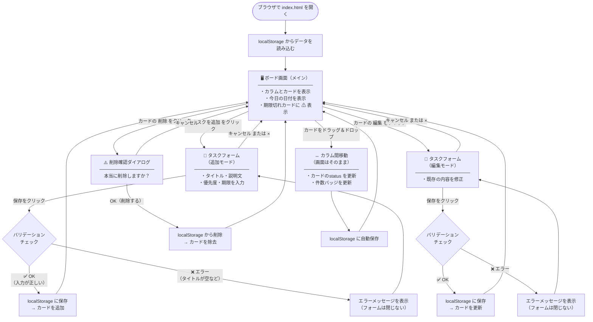

# 画面設計書

**プロジェクト名：** タスク管理ボード  
**作成日：** 2026年4月25日  
**バージョン：** 1.0  
**作成者：** ○○（開発担当）

> 本ドキュメントは [要件定義書](../要件定義書.md) から画面設計・操作フローに関する内容を分離したものです。

---

## 目次

1. [ユースケース・操作フロー](#1-ユースケース操作フロー)
2. [画面一覧](#2-画面一覧)
3. [ボード画面](#3-ボード画面)
4. [タスクカード（詳細）](#4-タスクカード詳細)
5. [タスクフォーム（モーダル）](#5-タスクフォームモーダル)
6. [画面遷移図](#6-画面遷移図)

---

## 1. ユースケース・操作フロー

> ※ 「ユースケース」とは「利用者がこのシステムを使って何をするか」を整理したものです。  
> 「操作フロー」とは「どの順番でボタンを押して操作するか」の流れのことです。

---

### UC-01：タスクを新しく追加する

**誰が：** 利用者  
**目的：** やるべきことをボードに登録する

```
【操作の流れ】

①  ボード画面を開く
②  追加したいカラム（例：「やること」）の「＋ タスクを追加」ボタンをクリックする
③  タスク入力フォーム（モーダル）が表示される
④  タイトルを入力する（必須）
⑤  必要に応じて説明文・優先度・期限を入力する
⑥  「保存」ボタンをクリックする
⑦  フォームが閉じ、タスクカードがカラムに追加される
⑧  データはブラウザに自動保存される

【例外・エラー時の動作】
・タイトルが空欄の場合 → エラーメッセージを表示し、保存できない
・101文字以上の場合   → エラーメッセージを表示し、保存できない
```

---

### UC-02：タスクの状態を「進行中」に変える

**誰が：** 利用者  
**目的：** 作業を開始したタスクを「やること」から「進行中」に移動する

```
【操作の流れ】

①  「やること」カラムにある対象のタスクカードをドラッグする
②  「進行中」カラムの上にドロップする
③  タスクカードが「進行中」カラムに移動する
④  各カラムのタスク件数（バッジ）が自動で更新される
⑤  変更内容はブラウザに自動保存される
```

---

### UC-03：タスクの内容を修正する

**誰が：** 利用者  
**目的：** 登録したタスクのタイトル・期限などを変更する

```
【操作の流れ】

①  修正したいタスクカードの「編集」ボタンをクリックする
②  タスク入力フォーム（モーダル）が開き、現在の内容が表示される
③  修正したい項目を変更する
④  「保存」ボタンをクリックする
⑤  フォームが閉じ、カードの内容が更新される

【キャンセル時】
・「キャンセル」ボタンをクリックすると、変更は破棄されてフォームが閉じる
```

---

### UC-04：タスクを削除する

**誰が：** 利用者  
**目的：** 不要になったタスクを削除する

```
【操作の流れ】

①  削除したいタスクカードの「削除」ボタンをクリックする
②  確認ダイアログ（「本当に削除しますか？」）が表示される
③  「OK」をクリックするとタスクが削除される
④  「キャンセル」をクリックすると削除せずに戻る

【注意】
・削除したタスクは元に戻せない
```

---

### UC-05：ページを開いてタスクを確認する

**誰が：** 利用者  
**目的：** 今日やることを確認する

```
【操作の流れ】

①  ブラウザでindex.htmlを開く
②  保存済みのタスクが自動的に読み込まれ、カラムに表示される
③  今日の日付がヘッダーに表示される
④  期限切れのタスクに警告マーク（⚠）が赤く表示される
```

---

## 2. 画面一覧

| 画面名 | 表示方法 | 説明 |
|---|---|---|
| ボード画面 | 常時表示 | メイン画面。全てのカラムとカードを表示する |
| タスクフォーム | モーダル（ポップアップ） | タスクの追加・編集を行う入力画面 |
| 削除確認ダイアログ | ブラウザ標準ダイアログ | 削除前に確認を求める小窓 |

---

## 3. ボード画面

### レイアウト全体

```
┌──────────────────────────────────────────────────────┐
│  タスク管理ボード              2026年4月24日（金）      │  ← ヘッダー
├──────────────┬──────────────┬──────────────────────┤
│   やること    │    進行中    │        完了           │
│    ● 3       │    ● 1      │        ● 2           │  ← カラムヘッダー＋件数バッジ
│              │             │                      │
│ ┌──────────┐ │ ┌──────────┐│ ┌──────────┐          │
│ │ タスクA  │ │ │ タスクD  ││ │ タスクE  │          │
│ └──────────┘ │ └──────────┘│ └──────────┘          │
│ ┌──────────┐ │             │ ┌──────────┐          │
│ │ タスクB  │ │             │ │ タスクF  │          │
│ └──────────┘ │             │ └──────────┘          │
│ ┌──────────┐ │             │                      │
│ │ タスクC  │ │             │                      │
│ └──────────┘ │             │                      │
│              │             │                      │
│ ＋ タスクを追加│ ＋ タスクを追加│ ＋ タスクを追加       │  ← 追加ボタン
└──────────────┴──────────────┴──────────────────────┘
```

### ヘッダー部分

| 要素 | 内容 | 表示仕様 |
|---|---|---|
| アプリ名 | タスク管理ボード | 左寄せ・太字・大きめ文字 |
| 今日の日付 | YYYY年M月D日（曜日） | 右寄せ・通常文字 |

### カラムヘッダー部分

| 要素 | 内容 | 表示仕様 |
|---|---|---|
| カラム名 | やること / 進行中 / 完了 | 太字・中央寄せ |
| 件数バッジ | 数字を丸で囲んで表示 | カラム名の右横に表示 |
| 背景色 | カラムごとに色分け | やること：青系 / 進行中：黄系 / 完了：緑系（※デザイン時に確定） |

### タスク追加ボタン

| 要素 | 表示仕様 |
|---|---|
| ボタンラベル | 「＋ タスクを追加」 |
| 配置 | 各カラムの最下部 |
| 動作 | クリックするとタスクフォームが開く（対象カラムに紐付いて開く） |

---

## 4. タスクカード（詳細）

```
┌──────────────────────────────────────┐
│ タスクのタイトル（太字）                │  ← タイトル
│ 説明文（グレー文字・小さめ）            │  ← 説明文（任意）
│                                      │
│ [高] 　　　　　　　　 ⚠ 期限：4/20   │  ← 優先度バッジ・期限切れ警告・期限日
│ ─────────────────────────────────── │
│ [編集]　[削除]                        │  ← 操作ボタン
└──────────────────────────────────────┘
```

| 要素 | 表示仕様 |
|---|---|
| タイトル | 太字・黒文字・1〜2行で折り返し |
| 説明文 | 通常・グレー文字・最大3行で省略（...表示） |
| 優先度バッジ（高） | 赤背景・白文字・角丸・「高」と表示 |
| 優先度バッジ（中） | 黄背景・黒文字・角丸・「中」と表示 |
| 優先度バッジ（低） | グレー背景・白文字・角丸・「低」と表示 |
| 期限日 | 「期限：M/D」形式で表示。期限なしの場合は非表示 |
| 期限切れ警告 | 今日の日付を過ぎている場合、「⚠」を赤色で期限の左に表示 |
| 編集ボタン | 薄いグレー背景・「編集」テキスト |
| 削除ボタン | 薄い赤背景・「削除」テキスト |

---

## 5. タスクフォーム（モーダル）

> ※ タスクの追加・編集で共通して使用する入力画面

```
┌─────────────────────────────────────────┐
│ タスクを追加 ／ タスクを編集             × │  ← タイトル・閉じるボタン
│ ───────────────────────────────────── │
│ タイトル ＊                              │
│ ┌─────────────────────────────────┐   │
│ │                                 │   │
│ └─────────────────────────────────┘   │
│ ※ タイトルを入力してください（エラー時）   │
│                                        │
│ 説明文                                  │
│ ┌─────────────────────────────────┐   │
│ │                                 │   │
│ │                                 │   │
│ └─────────────────────────────────┘   │
│                                        │
│ 優先度 ＊          期限                  │
│ [高 ▼]           [日付を選択  📅]       │
│                                        │
│ ─────────────────────────────────── │
│                   [キャンセル] [保存]    │
└─────────────────────────────────────────┘
```

| 要素 | 仕様 |
|---|---|
| タイトル欄 | テキスト入力・最大100文字・必須（空欄で保存するとエラー表示） |
| 説明文欄 | テキストエリア・最大500文字・任意 |
| 優先度選択 | ドロップダウン（高／中／低）・必須・初期値：中 |
| 期限選択 | カレンダーUI・任意 |
| 保存ボタン | バリデーションOKのときだけ押せる状態になる |
| キャンセルボタン | 入力内容を破棄してフォームを閉じる |
| 閉じるボタン（×） | キャンセルボタンと同じ動作 |
| 背景クリック | フォームの外側をクリックしてもフォームは閉じない（誤操作防止） |

---

## 6. 画面遷移図

> ※ 「画面遷移図」とは「利用者がどの操作をすると、どの画面に移動するか」を図にしたものです。  
> 矢印の向きが「画面の移動方向」を表しています。



### 画面遷移のまとめ

| 現在の画面 | 操作 | 移動先 |
|---|---|---|
| ボード画面 | ＋タスクを追加 をクリック | タスクフォーム（追加モード） |
| ボード画面 | 編集 をクリック | タスクフォーム（編集モード） |
| ボード画面 | 削除 をクリック | 削除確認ダイアログ |
| ボード画面 | ドラッグ＆ドロップ | ボード画面（カラム移動・自動保存） |
| タスクフォーム | 保存（入力OK） | ボード画面（カード追加 or 更新） |
| タスクフォーム | 保存（入力エラー） | タスクフォーム（エラー表示のまま） |
| タスクフォーム | キャンセル / × | ボード画面（変更なし） |
| 削除確認ダイアログ | OK | ボード画面（カード削除） |
| 削除確認ダイアログ | キャンセル | ボード画面（変更なし） |
