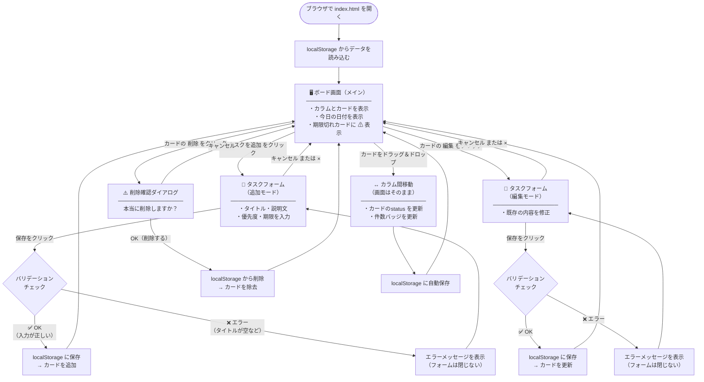
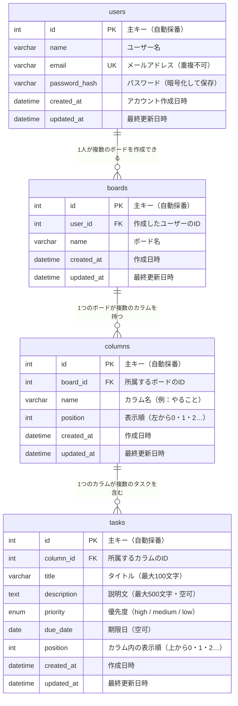

# 要件定義書

**プロジェクト名：** タスク管理ボード  
**作成日：** 2026年4月23日  
**最終更新日：** 2026年4月24日  
**バージョン：** 1.2  
**作成者：** ○○（開発担当）

---

## 改訂履歴

> ※ 「改訂履歴」とは、このドキュメントをいつ・誰が・どのように変更したかを記録した一覧です。  
> 「言った・言っていない」のトラブルを防ぐために、変更のたびに必ず記録します。

| バージョン | 更新日 | 変更内容 | 担当者 |
|---|---|---|---|
| 1.0 | 2026/04/23 | 初版作成 | ○○ |
| 1.1 | 2026/04/24 | 関係者欄・前提条件・受入条件・スケジュール・変更管理手順・ユースケース・画面仕様詳細・技術選定を追加 | ○○ |
| 1.2 | 2026/04/24 | 画面遷移図・ER図・テーブル定義を追加 | ○○ |

---

## 関係者・承認欄

> ※ 「承認欄」とは、この要件定義書の内容に関わる人全員が「内容を確認・合意した」ことを証明する記録です。  
> 署名・確認日が記入されてはじめて、この文書は正式な合意書類となります。

| 役割 | 氏名 | 確認日 | 署名 |
|---|---|---|---|
| 発注者（依頼者） | ○○ 様 | 　　年　　月　　日 | 　　　　　　 |
| 受注者（開発担当） | ○○ | 2026年4月24日 | 　　　　　　 |
| レビュー担当（確認者） | ○○ | 　　年　　月　　日 | 　　　　　　 |

> **注意：** 上記の「発注者」欄に署名・日付の記入が完了するまで、開発作業は開始しません。  
> 内容に変更が生じた場合は、変更後のバージョンに対して再度確認・署名を行っていただきます。

---

## 目次

1. [プロジェクト概要](#1-プロジェクト概要)
2. [前提条件と制約事項](#2-前提条件と制約事項)
3. [機能要件](#3-機能要件)
4. [非機能要件](#4-非機能要件)
5. [対象外（スコープ外）](#5-対象外スコープ外)
6. [ユースケース・操作フロー](#6-ユースケース操作フロー)
7. [画面設計（詳細）](#7-画面設計詳細)
   - 7-5. [画面遷移図](#7-5-画面遷移図)
8. [データ設計](#8-データ設計)
   - 8-5. [ER図（将来のDB設計）](#8-5-er図将来のdb設計)
   - 8-6. [テーブル定義（詳細）](#8-6-テーブル定義詳細)
9. [技術選定](#9-技術選定)
10. [ファイル構成](#10-ファイル構成)
11. [スケジュール・マイルストーン](#11-スケジュールマイルストーン)
12. [受入条件（検収基準）](#12-受入条件検収基準)
13. [変更管理の手順](#13-変更管理の手順)
14. [用語集](#14-用語集)

---

## 1. プロジェクト概要

### 1-1. 背景・課題

#### 背景

個人のタスク（やるべきこと）を管理する方法は、手帳・付箋・メモアプリなど様々ある。  
しかし以下のような課題を抱えるユーザーが多い。

#### 現在の課題

| No. | 課題 | 具体的な状況 |
|---|---|---|
| 課題① | タスクの抜け漏れが起きやすい | 付箋やメモが増えると、どれが未対応かわからなくなる |
| 課題② | 進捗の把握が難しい | 「やった」「やってない」「作業中」が一目で見えない |
| 課題③ | 期限の管理が曖昧 | 締め切りを別のカレンダーで管理しており、タスクと紐付いていない |
| 課題④ | 優先順位がわからなくなる | 緊急度・重要度が視覚的に区別できていない |

#### 解決策

上記の課題を解決するため、「ボード形式のタスク管理Webアプリ」を開発する。  
タスクを「やること・進行中・完了」の3列で視覚的に整理することで、状況が一目でわかる画面を提供する。

---

### 1-2. 目的

このシステムが実現することを一言で表すと：

> **「今自分が何をすべきか・何をしているか・何が終わったか」を、画面を開けば即座に把握できるようにする。**

---

### 1-3. 対象ユーザー

| 項目 | 内容 |
|---|---|
| 主な利用者 | 個人でタスクを管理したい人 |
| ITスキル | パソコンの基本操作（文字入力・クリック）ができれば使える |
| 利用シーン | 仕事の作業管理、勉強の進捗管理、日常のToDoリストなど |

---

### 1-4. 利用環境

| 項目 | 内容 |
|---|---|
| 対応ブラウザ | Google Chrome（最新版）、Safari（最新版） |
| 対応デバイス | パソコン（スマートフォン対応は対象外） |
| インターネット接続 | 不要（インターネットなしでも動作する） |
| サーバー | 不要（ブラウザだけで完結する） |

---

## 2. 前提条件と制約事項

> ※ 「前提条件」とは「この開発を進めるにあたって、あらかじめ決まっていること・前提としていること」です。  
> 「制約事項」とは「どうしても変えられない条件」のことです。  
> これらを明確にしておくことで、後から「そんな条件は聞いていない」というトラブルを防ぎます。

### 2-1. 前提条件

| No. | 前提条件 | 説明 |
|---|---|---|
| P-01 | 利用者はブラウザの基本操作ができる | ボタンのクリック・文字入力・ファイルを開く操作ができることを前提とする |
| P-02 | 利用ブラウザは最新版を使用する | Chrome・Safariの最新版を利用者自身で更新・維持する |
| P-03 | データは端末ごとに独立して保存される | 同じアカウントでも、別のパソコンやブラウザからは同じデータを見ることができない |
| P-04 | データのバックアップは利用者が行う | システムは自動バックアップを行わない。データの消失リスクは利用者が負う |
| P-05 | 開発環境はローカル（自分のPC）上で動作する | 外部サーバーへの公開・デプロイは本バージョンの対象外とする |

### 2-2. 制約事項

| No. | 制約事項 | 説明 |
|---|---|---|
| C-01 | サーバーを使用しない | データはブラウザ内のlocalStorageに保存する。サーバーへの通信は一切行わない |
| C-02 | データ容量の上限がある | localStorageの容量はブラウザによって異なるが、一般的に約5MB。大量データには対応しない |
| C-03 | 複数ユーザーでの共有は対象外 | 1台のパソコン・1つのブラウザでの個人利用のみを想定する |
| C-04 | スマートフォン対応は対象外 | 画面デザインはPC専用とする |
| C-05 | ブラウザのキャッシュ削除でデータが消える | 利用者がブラウザのデータを削除した場合、保存済みタスクも消える。この点を利用者に周知する |

---

## 3. 機能要件

> ※ 「機能要件」とは「このシステムが必ず持っていなければならない機能の一覧」です。

### 3-1. ボード画面

| No. | 機能名 | 詳細 |
|---|---|---|
| F-01 | 今日の日付表示 | 画面上部に「YYYY年M月D日（曜日）」形式で表示する |
| F-02 | カラム表示 | 「やること」「進行中」「完了」の3列を横並びで表示する |
| F-03 | タスク件数表示 | 各カラムのタスク数をバッジ（数字の丸）で表示する |

### 3-2. タスクカード

| No. | 機能名 | 詳細 |
|---|---|---|
| F-04 | タイトル表示 | タスクのタイトルを表示する（入力必須） |
| F-05 | 説明文表示 | タスクの説明文を表示する（任意） |
| F-06 | 優先度表示 | 「高／中／低」をカラーバッジで表示する |
| F-07 | 期限表示 | 期限日を「M/D」形式で表示する（任意） |
| F-08 | 期限切れ警告 | 期限を過ぎたカードに警告マーク（⚠）を赤色で表示する |

### 3-3. タスク操作

| No. | 機能名 | 詳細 |
|---|---|---|
| F-09 | タスク追加 | 各カラムの「＋ タスクを追加」ボタンからフォームを開いて追加できる |
| F-10 | タスク編集 | カードの「編集」ボタンから内容を変更できる |
| F-11 | タスク削除 | カードの「削除」ボタンから削除できる（確認ダイアログあり） |
| F-12 | カラム移動 | カードをドラッグ＆ドロップで別のカラムに移動できる |

### 3-4. 入力フォーム

| No. | 項目名 | 種別 | 必須 | 備考 |
|---|---|---|---|---|
| F-13 | タイトル | テキスト入力 | ○ | 最大100文字 |
| F-14 | 説明文 | テキストエリア | — | 任意入力・最大500文字 |
| F-15 | 優先度 | ドロップダウン | ○ | 高 / 中（初期値） / 低 |
| F-16 | 期限 | 日付入力 | — | カレンダーから選択 |

### 3-5. データ保存

| No. | 機能名 | 詳細 |
|---|---|---|
| F-17 | データ永続化 | ブラウザのlocalStorageにデータを保存する |
| F-18 | 自動読み込み | ページを開いたとき、保存済みのタスクを自動で表示する |

### 3-6. バリデーション（入力チェック）

> ※ 「バリデーション」とは「入力内容が正しいかどうかをチェックすること」です。

| No. | チェック対象 | 条件 | エラー時の動作 |
|---|---|---|---|
| V-01 | タイトル | 空欄は不可 | 「タイトルを入力してください」と赤文字で表示し、保存ボタンを無効にする |
| V-02 | タイトル | 101文字以上は不可 | 「100文字以内で入力してください」と赤文字で表示する |
| V-03 | 説明文 | 501文字以上は不可 | 「500文字以内で入力してください」と赤文字で表示する |
| V-04 | 期限 | 過去の日付を入力した場合 | 保存は可能だが、カードに警告マーク（⚠）を表示する |

---

## 4. 非機能要件

> ※ 「非機能要件」とは「機能そのものではなく、動作の速さ・使いやすさ・安全性など品質に関する要件」のことです。

| No. | 種別 | 要件 | 補足説明 |
|---|---|---|---|
| N-01 | パフォーマンス | ページ読み込みから1秒以内に表示が完了すること | 通常の家庭用PCで計測する |
| N-02 | 操作性 | ボタンや入力欄は直感的に操作できること | 説明書なしで操作できるレベルを目指す |
| N-03 | セキュリティ | ユーザーが入力した文字列はXSS対策（エスケープ処理）を施すこと | 悪意のある文字が入力されても画面が壊れない仕組みを実装する |
| N-04 | 保守性 | カラムの追加・優先度の変更などが設定値の編集だけでできること | 機能追加時にコード全体を書き直さなくてよい設計にする |
| N-05 | 可読性 | コードに日本語コメントを付け、初心者でも読めること | 将来の改修担当者が内容を理解しやすい状態を維持する |

---

## 5. 対象外（スコープ外）

> ※ 「スコープ外」とは「今回は作らないと明確に決めた機能」のことです。  
> 何を作らないかを明示することで、認識のズレを防ぎます。

以下は今回のバージョンでは開発しません。

| 対象外の機能 | 理由・補足 |
|---|---|
| ユーザー認証（ログイン・パスワード） | 個人利用のため不要。将来バージョンで対応を検討 |
| 担当者の設定 | 個人利用のため不要 |
| 複数人での共有・リアルタイム同期 | サーバーが必要なため対象外 |
| スマートフォン対応（レスポンシブデザイン） | 開発工数の都合上、今回はPC専用とする |
| サーバーへのデータ保存 | サーバー構築が必要なため対象外 |
| タスクの並び替え（優先度順・期限順） | 今後のバージョンで対応を検討 |
| タスクの検索・絞り込み | 今後のバージョンで対応を検討 |

---

## 6. ユースケース・操作フロー

> ※ 「ユースケース」とは「利用者がこのシステムを使って何をするか」を整理したものです。  
> 「操作フロー」とは「どの順番でボタンを押して操作するか」の流れのことです。  
> これにより、開発者と依頼者が「システムの使い方」について共通のイメージを持てます。

---

### UC-01：タスクを新しく追加する

**誰が：** 利用者  
**目的：** やるべきことをボードに登録する

```
【操作の流れ】

①  ボード画面を開く
②  追加したいカラム（例：「やること」）の「＋ タスクを追加」ボタンをクリックする
③  タスク入力フォーム（モーダル）が表示される
④  タイトルを入力する（必須）
⑤  必要に応じて説明文・優先度・期限を入力する
⑥  「保存」ボタンをクリックする
⑦  フォームが閉じ、タスクカードがカラムに追加される
⑧  データはブラウザに自動保存される

【例外・エラー時の動作】
・タイトルが空欄の場合 → エラーメッセージを表示し、保存できない
・101文字以上の場合   → エラーメッセージを表示し、保存できない
```

---

### UC-02：タスクの状態を「進行中」に変える

**誰が：** 利用者  
**目的：** 作業を開始したタスクを「やること」から「進行中」に移動する

```
【操作の流れ】

①  「やること」カラムにある対象のタスクカードをドラッグする
②  「進行中」カラムの上にドロップする
③  タスクカードが「進行中」カラムに移動する
④  各カラムのタスク件数（バッジ）が自動で更新される
⑤  変更内容はブラウザに自動保存される
```

---

### UC-03：タスクの内容を修正する

**誰が：** 利用者  
**目的：** 登録したタスクのタイトル・期限などを変更する

```
【操作の流れ】

①  修正したいタスクカードの「編集」ボタンをクリックする
②  タスク入力フォーム（モーダル）が開き、現在の内容が表示される
③  修正したい項目を変更する
④  「保存」ボタンをクリックする
⑤  フォームが閉じ、カードの内容が更新される

【キャンセル時】
・「キャンセル」ボタンをクリックすると、変更は破棄されてフォームが閉じる
```

---

### UC-04：タスクを削除する

**誰が：** 利用者  
**目的：** 不要になったタスクを削除する

```
【操作の流れ】

①  削除したいタスクカードの「削除」ボタンをクリックする
②  確認ダイアログ（「本当に削除しますか？」）が表示される
③  「OK」をクリックするとタスクが削除される
④  「キャンセル」をクリックすると削除せずに戻る

【注意】
・削除したタスクは元に戻せない
```

---

### UC-05：ページを開いてタスクを確認する

**誰が：** 利用者  
**目的：** 今日やることを確認する

```
【操作の流れ】

①  ブラウザでindex.htmlを開く
②  保存済みのタスクが自動的に読み込まれ、カラムに表示される
③  今日の日付がヘッダーに表示される
④  期限切れのタスクに警告マーク（⚠）が赤く表示される
```

---

## 7. 画面設計（詳細）

> ※ 「画面設計」とは「実際の画面がどのような見た目・構成になるか」を定義したものです。

### 7-1. 画面一覧

| 画面名 | 表示方法 | 説明 |
|---|---|---|
| ボード画面 | 常時表示 | メイン画面。全てのカラムとカードを表示する |
| タスクフォーム | モーダル（ポップアップ） | タスクの追加・編集を行う入力画面 |
| 削除確認ダイアログ | ブラウザ標準ダイアログ | 削除前に確認を求める小窓 |

---

### 7-2. ボード画面

#### レイアウト全体

```
┌──────────────────────────────────────────────────────┐
│  タスク管理ボード              2026年4月24日（金）      │  ← ヘッダー
├──────────────┬──────────────┬──────────────────────┤
│   やること    │    進行中    │        完了           │
│    ● 3       │    ● 1      │        ● 2           │  ← カラムヘッダー＋件数バッジ
│              │             │                      │
│ ┌──────────┐ │ ┌──────────┐│ ┌──────────┐          │
│ │ タスクA  │ │ │ タスクD  ││ │ タスクE  │          │
│ └──────────┘ │ └──────────┘│ └──────────┘          │
│ ┌──────────┐ │             │ ┌──────────┐          │
│ │ タスクB  │ │             │ │ タスクF  │          │
│ └──────────┘ │             │ └──────────┘          │
│ ┌──────────┐ │             │                      │
│ │ タスクC  │ │             │                      │
│ └──────────┘ │             │                      │
│              │             │                      │
│ ＋ タスクを追加│ ＋ タスクを追加│ ＋ タスクを追加       │  ← 追加ボタン
└──────────────┴──────────────┴──────────────────────┘
```

#### ヘッダー部分

| 要素 | 内容 | 表示仕様 |
|---|---|---|
| アプリ名 | タスク管理ボード | 左寄せ・太字・大きめ文字 |
| 今日の日付 | YYYY年M月D日（曜日） | 右寄せ・通常文字 |

#### カラムヘッダー部分

| 要素 | 内容 | 表示仕様 |
|---|---|---|
| カラム名 | やること / 進行中 / 完了 | 太字・中央寄せ |
| 件数バッジ | 数字を丸で囲んで表示 | カラム名の右横に表示 |
| 背景色 | カラムごとに色分け | やること：青系 / 進行中：黄系 / 完了：緑系（※デザイン時に確定） |

#### タスク追加ボタン

| 要素 | 表示仕様 |
|---|---|
| ボタンラベル | 「＋ タスクを追加」 |
| 配置 | 各カラムの最下部 |
| 動作 | クリックするとタスクフォームが開く（対象カラムに紐付いて開く） |

---

### 7-3. タスクカード（詳細）

```
┌──────────────────────────────────────┐
│ タスクのタイトル（太字）                │  ← タイトル
│ 説明文（グレー文字・小さめ）            │  ← 説明文（任意）
│                                      │
│ [高] 　　　　　　　　 ⚠ 期限：4/20   │  ← 優先度バッジ・期限切れ警告・期限日
│ ─────────────────────────────────── │
│ [編集]　[削除]                        │  ← 操作ボタン
└──────────────────────────────────────┘
```

| 要素 | 表示仕様 |
|---|---|
| タイトル | 太字・黒文字・1〜2行で折り返し |
| 説明文 | 通常・グレー文字・最大3行で省略（...表示） |
| 優先度バッジ（高） | 赤背景・白文字・角丸・「高」と表示 |
| 優先度バッジ（中） | 黄背景・黒文字・角丸・「中」と表示 |
| 優先度バッジ（低） | グレー背景・白文字・角丸・「低」と表示 |
| 期限日 | 「期限：M/D」形式で表示。期限なしの場合は非表示 |
| 期限切れ警告 | 今日の日付を過ぎている場合、「⚠」を赤色で期限の左に表示 |
| 編集ボタン | 薄いグレー背景・「編集」テキスト |
| 削除ボタン | 薄い赤背景・「削除」テキスト |

---

### 7-4. タスクフォーム（モーダル）

> ※ タスクの追加・編集で共通して使用する入力画面

```
┌─────────────────────────────────────────┐
│ タスクを追加 ／ タスクを編集             × │  ← タイトル・閉じるボタン
│ ───────────────────────────────────── │
│ タイトル ＊                              │
│ ┌─────────────────────────────────┐   │
│ │                                 │   │
│ └─────────────────────────────────┘   │
│ ※ タイトルを入力してください（エラー時）   │
│                                        │
│ 説明文                                  │
│ ┌─────────────────────────────────┐   │
│ │                                 │   │
│ │                                 │   │
│ └─────────────────────────────────┘   │
│                                        │
│ 優先度 ＊          期限                  │
│ [高 ▼]           [日付を選択  📅]       │
│                                        │
│ ─────────────────────────────────── │
│                   [キャンセル] [保存]    │
└─────────────────────────────────────────┘
```

| 要素 | 仕様 |
|---|---|
| タイトル欄 | テキスト入力・最大100文字・必須（空欄で保存するとエラー表示） |
| 説明文欄 | テキストエリア・最大500文字・任意 |
| 優先度選択 | ドロップダウン（高／中／低）・必須・初期値：中 |
| 期限選択 | カレンダーUI・任意 |
| 保存ボタン | バリデーションOKのときだけ押せる状態になる |
| キャンセルボタン | 入力内容を破棄してフォームを閉じる |
| 閉じるボタン（×） | キャンセルボタンと同じ動作 |
| 背景クリック | フォームの外側をクリックしてもフォームは閉じない（誤操作防止） |

---

### 7-5. 画面遷移図

> ※ 「画面遷移図」とは「利用者がどの操作をすると、どの画面に移動するか」を図にしたものです。  
> 矢印の向きが「画面の移動方向」を表しています。  
> これにより、開発者と依頼者が「操作の全体像」を同じイメージで共有できます。



#### 画面遷移のまとめ

| 現在の画面 | 操作 | 移動先 |
|---|---|---|
| ボード画面 | ＋タスクを追加 をクリック | タスクフォーム（追加モード） |
| ボード画面 | 編集 をクリック | タスクフォーム（編集モード） |
| ボード画面 | 削除 をクリック | 削除確認ダイアログ |
| ボード画面 | ドラッグ＆ドロップ | ボード画面（カラム移動・自動保存） |
| タスクフォーム | 保存（入力OK） | ボード画面（カード追加 or 更新） |
| タスクフォーム | 保存（入力エラー） | タスクフォーム（エラー表示のまま） |
| タスクフォーム | キャンセル / × | ボード画面（変更なし） |
| 削除確認ダイアログ | OK | ボード画面（カード削除） |
| 削除確認ダイアログ | キャンセル | ボード画面（変更なし） |

---

## 8. データ設計

> ※ 「データ設計」とは「システムがどのような情報を・どのような形で保存するか」を定義したものです。

### 8-1. タスクデータの構造

ブラウザの localStorage に以下の形式でデータを保存する。

```json
[
  {
    "id":        "一意のID（自動生成・例：task_1714000000000）",
    "title":     "タスクのタイトル（最大100文字）",
    "desc":      "説明文（空でも可・最大500文字）",
    "priority":  "high / medium / low のいずれか",
    "dueDate":   "2026-04-30（任意・空の場合は空文字）",
    "status":    "todo / doing / done のいずれか",
    "createdAt": "2026-04-23T10:00:00.000Z（作成日時・自動記録）"
  }
]
```

### 8-2. 各項目の説明

| 項目名 | 日本語の意味 | 必須 | 取りうる値 |
|---|---|---|---|
| id | タスクを識別するための番号 | ○ | 自動生成（重複しない） |
| title | タスクのタイトル | ○ | 文字列（最大100文字） |
| desc | タスクの説明文 | — | 文字列（最大500文字）または空 |
| priority | 優先度 | ○ | `high`（高）/ `medium`（中）/ `low`（低） |
| dueDate | 期限日 | — | `YYYY-MM-DD`形式または空 |
| status | タスクの状態（カラム） | ○ | `todo` / `doing` / `done` |
| createdAt | タスクを作成した日時 | ○ | 日時（自動記録） |

### 8-3. ステータスと表示カラムの対応

| status値 | 表示カラム |
|---|---|
| `todo` | やること |
| `doing` | 進行中 |
| `done` | 完了 |

### 8-4. データの保存先

| 項目 | 内容 |
|---|---|
| 保存場所 | ブラウザの localStorage（`taskboard_tasks`というキー名で保存） |
| 保存タイミング | タスクの追加・編集・削除・移動のたびに自動保存 |
| 読み込みタイミング | ページを開いたとき（ブラウザ起動時） |

---

### 8-5. ER図（将来のDB設計）

> ※ 「ER図」とは「データベースのテーブル（表）がどのような構造で、お互いにどう関連しているか」を図にしたものです。  
> 「E」は Entity（エンティティ：データのまとまり＝テーブル）、「R」は Relation（リレーション：テーブル間のつながり）の略です。  
>
> 現バージョンはブラウザ内のlocalStorageを使用していますが、将来的にサーバー・データベースを導入することを想定し、  
> その際に必要になるテーブル設計をここに定義します。

#### 将来バージョンで追加されるテーブル

| テーブル名 | 日本語の意味 | 役割 |
|---|---|---|
| users | ユーザー | ログインする人の情報（名前・メール・パスワード） |
| boards | ボード | ユーザーが持つタスクボード（複数作れる） |
| columns | カラム | ボード内の列（やること・進行中・完了） |
| tasks | タスク | カラムに入るタスクカードの情報 |

#### ER図



#### ER図の読み方（記号の意味）

| 記号 | 意味 | 例 |
|---|---|---|
| `\|\|` | 必ず1つ | ユーザーは必ず1人 |
| `o{` | 0個以上（複数でも0でも可） | ボードは0個以上持てる |
| `\|\|--o{` | 「1対多」の関係 | 1人のユーザーが複数のボードを持てる |

---

### 8-6. テーブル定義（詳細）

> ※ 「テーブル定義」とは「各テーブルの列（カラム）に、どんな種類のデータが入るか」を詳しく定めたものです。  
> Excelでいう「列の設定」のようなものです。

#### usersテーブル（ユーザー情報）

| 列名 | データ型 | 必須 | 制約 | 説明 |
|---|---|---|---|---|
| id | INT | ○ | 主キー・自動採番 | ユーザーを識別する番号 |
| name | VARCHAR(100) | ○ | — | ユーザー名（最大100文字） |
| email | VARCHAR(255) | ○ | 重複不可（UNIQUE） | ログインに使うメールアドレス |
| password_hash | VARCHAR(255) | ○ | — | パスワードを暗号化した文字列（平文では保存しない） |
| created_at | DATETIME | ○ | 自動入力 | アカウント作成日時 |
| updated_at | DATETIME | ○ | 自動更新 | 最終更新日時 |

#### boardsテーブル（ボード情報）

| 列名 | データ型 | 必須 | 制約 | 説明 |
|---|---|---|---|---|
| id | INT | ○ | 主キー・自動採番 | ボードを識別する番号 |
| user_id | INT | ○ | 外部キー（users.id） | このボードを作ったユーザーのID |
| name | VARCHAR(100) | ○ | — | ボード名（最大100文字） |
| created_at | DATETIME | ○ | 自動入力 | 作成日時 |
| updated_at | DATETIME | ○ | 自動更新 | 最終更新日時 |

#### columnsテーブル（カラム情報）

| 列名 | データ型 | 必須 | 制約 | 説明 |
|---|---|---|---|---|
| id | INT | ○ | 主キー・自動採番 | カラムを識別する番号 |
| board_id | INT | ○ | 外部キー（boards.id） | このカラムが属するボードのID |
| name | VARCHAR(100) | ○ | — | カラム名（例：やること） |
| position | INT | ○ | 0以上の整数 | 左から何番目に表示するか（0始まり） |
| created_at | DATETIME | ○ | 自動入力 | 作成日時 |
| updated_at | DATETIME | ○ | 自動更新 | 最終更新日時 |

#### tasksテーブル（タスク情報）

| 列名 | データ型 | 必須 | 制約 | 説明 |
|---|---|---|---|---|
| id | INT | ○ | 主キー・自動採番 | タスクを識別する番号 |
| column_id | INT | ○ | 外部キー（columns.id） | このタスクが属するカラムのID |
| title | VARCHAR(100) | ○ | — | タスクのタイトル（最大100文字） |
| description | TEXT | — | NULL可 | タスクの説明文（最大500文字） |
| priority | ENUM | ○ | high / medium / low のいずれか | 優先度 |
| due_date | DATE | — | NULL可 | 期限日（未設定の場合は空） |
| position | INT | ○ | 0以上の整数 | カラム内の表示順（上から0始まり） |
| created_at | DATETIME | ○ | 自動入力 | タスク作成日時 |
| updated_at | DATETIME | ○ | 自動更新 | 最終更新日時 |

#### テーブル間のつながり（外部キー）の説明

> ※ 「外部キー」とは「別のテーブルのIDを参照する列」のことです。  
> これにより、テーブル間のデータの整合性（矛盾がない状態）を保ちます。

```
users（ユーザー）
  └── boards（ボード）      ← user_id で users.id を参照
        └── columns（カラム）  ← board_id で boards.id を参照
              └── tasks（タスク）  ← column_id で columns.id を参照
```

> **削除時の連鎖（CASCADE）：**  
> ユーザーを削除 → そのユーザーのボードも削除 → カラムも削除 → タスクも削除  
> データの孤立（親がいないデータ）が残らないよう設計する。

---

## 9. 技術選定

> ※ 「技術選定」とは「このシステムを作るためにどの技術・道具を使うか」を決め、その理由を説明したものです。  
> なぜその技術を選んだのかを記録しておくことで、後から別の人が見ても意図を理解できます。

### 9-1. 採用技術一覧

| 技術名 | 役割 | 採用理由 |
|---|---|---|
| HTML | 画面の骨格（構造）を作る | Webページを作るための基本言語。特別なインストール不要 |
| CSS | デザイン・見た目を整える | HTMLと組み合わせて色・レイアウト・文字サイズを調整する |
| JavaScript | 動きのある機能を実装する | ボタンクリックやデータ保存など「動作」を担当する |
| localStorage | データの保存 | ブラウザ標準の保存機能。サーバーなしでデータを永続化できる |

### 9-2. 検討した技術と不採用の理由

| 技術名 | 不採用の理由 |
|---|---|
| React / Vue.js（JavaScriptフレームワーク） | 学習コストが高く、今回の規模には過剰。インストールも必要になる |
| データベース（MySQL・SQLiteなど） | サーバーの構築が必要になるため対象外 |
| TypeScript | 今回は学習・個人用途のため不要。将来の拡張時に検討する |

### 9-3. 外部ライブラリ・依存関係

| 項目 | 内容 |
|---|---|
| 外部ライブラリ | **なし**（ドラッグ＆ドロップ含め、すべてVanilla JavaScript で実装） |
| CDN利用 | **なし** |
| インストール作業 | **不要**（ファイルをブラウザで開くだけで動作する） |

> **補足：** 外部ライブラリを使わないことで、インターネット接続なしでも動作し、バージョン更新などのメンテナンスが不要になる。

---

## 10. ファイル構成

```
task-board/
├── index.html     # 画面の骨格（HTML）
├── style.css      # デザイン（CSS）
├── app.js         # 動作ロジック（JavaScript）
└── 要件定義書.md  # 本ドキュメント
```

---

## 11. スケジュール・マイルストーン

> ※ 「マイルストーン」とは「プロジェクトの中で重要な区切りとなる節目」のことです。  
> スケジュールを明示することで、いつまでに何が完成するかを双方が把握できます。

| No. | フェーズ | 内容 | 予定日 | 状態 |
|---|---|---|---|---|
| M-01 | 要件定義 | 要件の確認・合意・承認 | 2026/04/25 | 進行中 |
| M-02 | 画面実装 | HTML・CSSによる画面の構築 | 2026/04/28 | 未着手 |
| M-03 | 機能実装 | JavaScriptによる機能の実装 | 2026/05/05 | 未着手 |
| M-04 | テスト・修正 | 動作確認・バグ修正 | 2026/05/08 | 未着手 |
| M-05 | 納品・検収 | 成果物の提出・受入確認 | 2026/05/10 | 未着手 |

> **注意：**  
> - スケジュールは要件定義の承認日（M-01）を起点として確定します。  
> - 仕様変更が発生した場合、スケジュールを見直す可能性があります。

---

## 12. 受入条件（検収基準）

> ※ 「受入条件」とは「どのような状態になったら納品完了とみなすか」の基準です。  
> これを事前に定めることで、「完成の定義」について認識のズレを防ぎます。

### 12-1. 機能面の確認項目

| No. | 確認項目 | 合否 |
|---|---|---|
| A-01 | 機能要件 F-01〜F-18 がすべて動作すること | |
| A-02 | バリデーション V-01〜V-04 がすべて正しく動作すること | |
| A-03 | ドラッグ＆ドロップでカラム間を移動できること | |
| A-04 | ページを閉じて再度開いても、タスクが保持されていること | |
| A-05 | 期限切れタスクに警告マーク（⚠）が赤く表示されること | |

### 12-2. 品質面の確認項目

| No. | 確認項目 | 合否 |
|---|---|---|
| A-06 | Google Chrome 最新版で正常に動作すること | |
| A-07 | Safari 最新版で正常に動作すること | |
| A-08 | ページの表示が1秒以内に完了すること | |
| A-09 | XSS対策（エスケープ処理）が施されていること | |

### 12-3. ドキュメント面の確認項目

| No. | 確認項目 | 合否 |
|---|---|---|
| A-10 | 本要件定義書に記載された仕様と実装が一致していること | |
| A-11 | ソースコードに日本語コメントが付いていること | |

> **検収手順：**  
> 1. 開発担当者が上記チェックリストを実施し、すべて「合」であることを確認する  
> 2. 成果物（ファイル一式）を依頼者に提出する  
> 3. 依頼者が動作確認を行い、問題がなければ検収完了とする  
> 4. 問題があった場合は、内容を書面（メール可）で共有し、修正後に再確認を行う

---

## 13. 変更管理の手順

> ※ 「変更管理」とは「開発途中で仕様（作るものの内容）が変わった場合に、どのように対応するかのルール」です。  
> ルールを決めておくことで、変更による混乱・トラブルを防ぎます。

### 13-1. 変更が生じた場合の流れ

```
①  変更を要望する側（依頼者または開発者）が変更内容を書面（メール可）で相手に伝える
        ↓
②  開発担当者が変更の影響範囲・作業量・スケジュールへの影響を確認する
        ↓
③  両者で変更内容・対応方針・スケジュール修正について合意する
        ↓
④  本要件定義書をバージョンアップし（例：1.1 → 1.2）、改訂履歴に記録する
        ↓
⑤  更新した要件定義書を依頼者に再確認・承認していただく
        ↓
⑥  承認後、変更作業を開始する
```

### 13-2. 変更管理のルール

| ルール | 内容 |
|---|---|
| 口頭の変更依頼は受け付けない | 誤解・記憶違いを防ぐため、必ず書面（メールなど）で伝える |
| 合意なしに変更作業を開始しない | 両者が合意した内容のみを開発する |
| 変更によるスケジュール影響は都度協議する | 大きな変更は納期の見直しが必要になる場合がある |
| 変更のたびに要件定義書を更新する | 最新の要件定義書が「唯一の正しい仕様書」となるよう管理する |

---

## 14. 用語集

> ※ ITに詳しくない方でも読めるよう、本書で使用する専門用語を解説します。

| 用語 | 説明 |
|---|---|
| カラム | タスクを縦に並べる列（やること・進行中・完了の3列） |
| カード | 1つのタスクの情報をまとめて表示するブロック |
| モーダル | 画面の上に重ねて表示されるポップアップウィンドウ |
| localStorage | ブラウザの中にデータを保存しておく仕組み。電源を切っても消えない |
| XSS | 悪意のある文字列をWebページに埋め込む攻撃。対策としてエスケープ処理を行う |
| エスケープ処理 | 特殊な文字（<、>など）を無害な形に変換する処理。セキュリティ対策のひとつ |
| ドラッグ＆ドロップ | 要素をマウスでつかんだまま別の場所に移動させる操作 |
| バリデーション | ユーザーが入力した内容が正しいかどうかをチェックすること |
| スコープ | 今回の開発で「作る範囲」のこと |
| マイルストーン | プロジェクトの中で重要な節目となる日程・目標 |
| 検収 | 依頼者が成果物を確認し、問題なければ受け取りを承認すること |
| Vanilla JavaScript | 外部ライブラリを使わない、素のJavaScript のこと |
